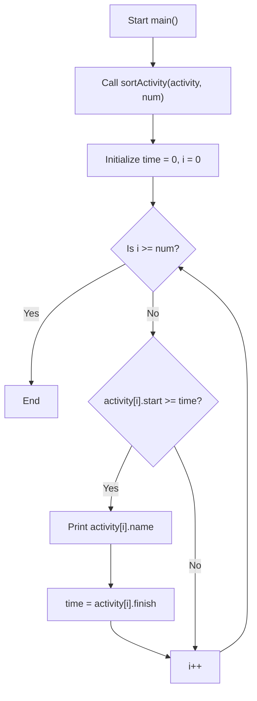

```mermaid

flowchart TD
    STArt["Start main()"] --> B["Call sortActivity(activity, num)"]
    B --> C[Initialize time = 0, i = 0]
    C --> D{Is i >= num?}
    D -- Yes --> E[End]
    D -- No --> F{"activity[i].start >= time?"}
    F -- Yes --> G["Print activity[i].name"]
    G --> H["time = activity[i].finish"]
    H --> I[i++]
    I --> D
    F -- No --> I

```